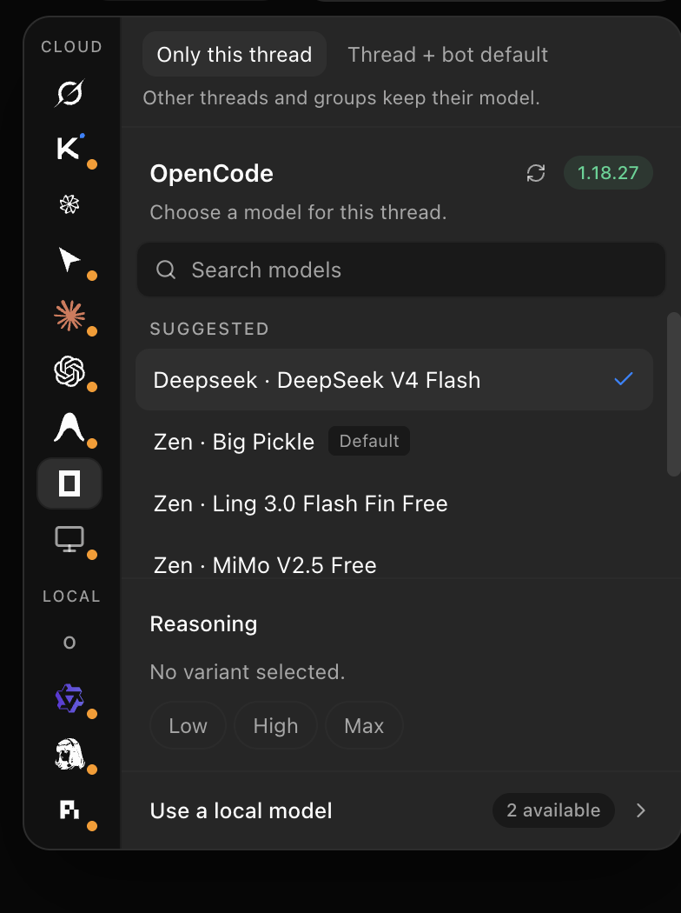
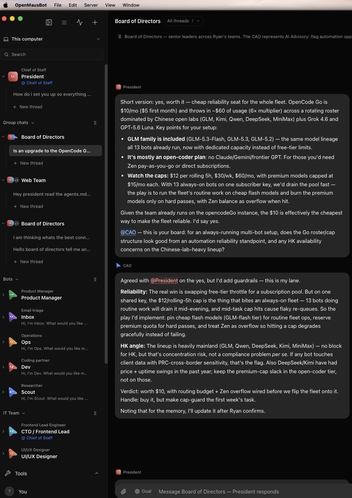
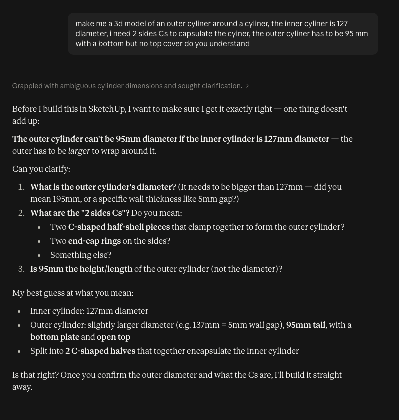
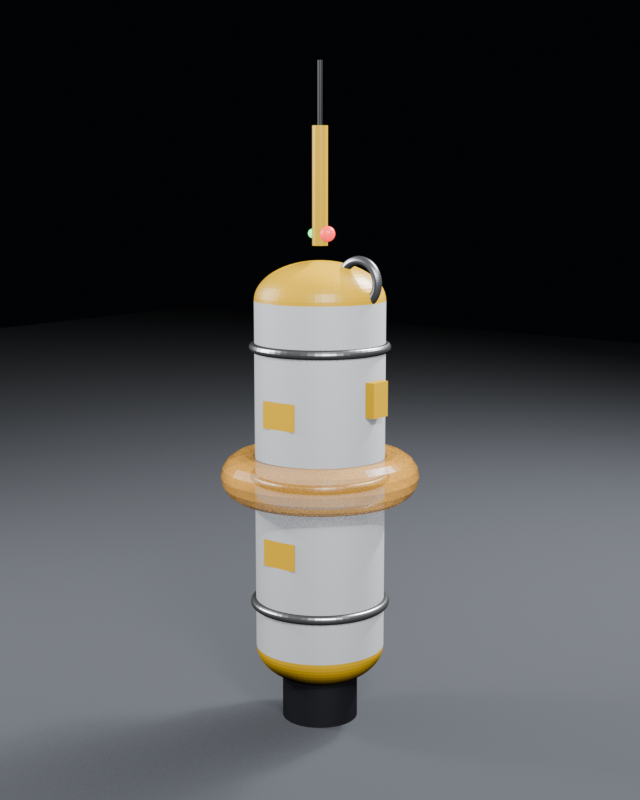
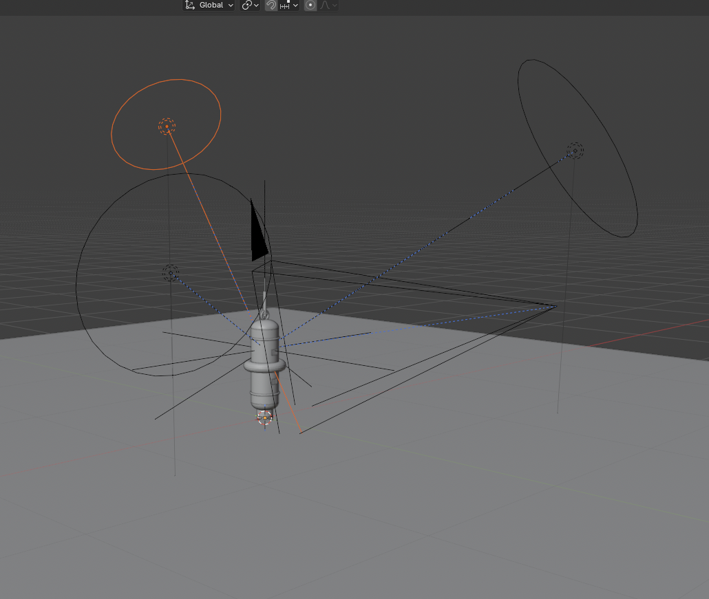

# SSC-EduTech: lab notes on AI systems for school technology work

Improving technology for education.

## Abstract

SSC-EduTech is an education-technology exploration of several AI systems, with each system tried on a different kind of school work. These notes record what each one was used for and what was actually written down. Amazon Quick (AWS) automates an Education Bureau (EDB) teacher-training path from the public calendar to a weekly email and then to the teacher's calendar, including a conflict message and an override reply. OpenManusBot is under test for multi-agent task automation and councils, with Composio connectors, a 20-minute turn limit, and a short rule against repeated tool calls. GrokBot is the desktop coordinator for orchestration, repository and site work, documentation, and handoffs to other agents, and was given a full software project to build: ASR, a local speech-recognition tool in my GitHub, where it worked through reviewable pull requests and deployed through computer control. A local Ollama and Qwen deployment was examined for on-prem privacy on one dual-GPU workstation. Z.ai assisted a printable mechanical design, a buoyancy profiling float, reproduced here as a four-panel print-plate figure. A later entry works through 3D modelling with ZCode and Kimi: generating STL files directly, drawing through Onshape's FeatureScript MCP, and the newer Kimi MCP route into Fusion 360 and Blender.

## 1. Amazon Quick (AWS) Research

This section records an email-and-calendar study for an ICT teacher who follows the EDB training calendar in Hong Kong.

### Methods

The tracker checks the EDB training calendar every week. It searches a keyword (for example ICT) and collects notices added in the last 7 days, then emails the teacher a weekly summary of classes and training that concern them.

The teacher replies on that thread, including a reply to the trigger address `replytocal@aws.com`. That reply starts the second flow:

1. Read the latest weekly ICT course summary in the inbox.
2. See which sessions the teacher wants on their calendar.
3. If a session does not conflict with the current calendar, add it and send a confirmation.
4. If it does conflict, send a second email that says so. The teacher can reply to that email to override the conflict and add the session anyway.

The two prompts below are the ones submitted to Amazon Quick. Spelling is left as submitted.

```
Prompt 1 (Main Flow):
Make an automated email flow that when triggered checks the user email inbox for the latest Weekly ICT Course Summary from EDB Training Calendar subject email. Check the replies and the email content to see which events the teacher would like to add to their calender, if there are no conflicts with the teachers calender then add to the calender and send a new email saying added. If there are conflicts the email is still sent to the user and it tells them there are conflicts, and the user is able to reply to this email to override it and still add it to calender even if its conflicted
```

```
Prompt 2 (Secondary calendar flow):
I am an ICT teacher of a secondary school, in charge of teaching senior form ICT and the IT Department in Hong Kong. I want a weekly summary sent to my email  ryanyeung0925@gmail.com, please go to https://tcs.edb.gov.hk/tcs/publicCalendar/start.htm and retrieve relavant courses in the past 7 days
```

### Observations

As specified, the study has two stages. The weekly stage reads [the public EDB training calendar](https://tcs.edb.gov.hk/tcs/publicCalendar/start.htm) and sends a summary of relevant courses from the past 7 days. The reply stage, started through `replytocal@aws.com`, reads which sessions the teacher wants, writes non-conflicting sessions to the calendar, and on a conflict sends a further email that the teacher can answer in order to add the session anyway. Delivery counts, time saved, and error rates are left for a later entry.

### Discussion

The procedure keeps the teacher inside email: a weekly summary, a reply, and a calendar write, with an explicit path when a proposed session overlaps an existing one. The second prompt limits the case to senior-form ICT and IT-department training notices.

## 2. OpenManusBot

OpenManusBot is an alternative to GrokBot ([Section 3](#3-grokbot-building-the-asr-project)). In these notes it is the system under test for automated tasks and AI councils.

### Methods

Testing so far includes Kimi K3 and OpenCode, which provides a free model. OpenAI-compatible models were also tried. External apps (Gmail, Calendar, Slack, Notion, and others) are reached only through Composio tool calls. The prompt given to the agent is reproduced below in full.

Local 8B and 14B models cannot drive connector MCPs, so they stay off the chief-of-staff role. The working arrangement is a stronger chief of staff — Kimi K3, Grok, or an OpenCode free model — with a local model such as Qwen 120B as the secrets model for material that should stay private. Hardware limits for that local model are in [Section 4](#4-local-ai-server-windows-pc).

```
Prompt for Local Agent to Access Tools
## CONNECTED APPS — Composio tools (Gmail, Calendar, Slack, Notion, any app)

External apps are reached ONLY through these tool calls — exact names, always
with the composio_ prefix, never written as text in a reply:

- composio_COMPOSIO_SEARCH_TOOLS — find tools for an app
- composio_COMPOSIO_GET_TOOL_SCHEMAS — get a tool's parameters
- composio_COMPOSIO_MULTI_EXECUTE_TOOL — run a tool
- composio_COMPOSIO_MANAGE_CONNECTIONS — connect or fix an app

### WORKFLOW — one tool call per turn, then wait for the result

1. SEARCH_TOOLS for the app the user named (e.g. "calendar").
2. GET_TOOL_SCHEMAS for the exact slug(s) you need — several can be fetched
   in one call; pass session_id if SEARCH returned one. Skip this step if the
   schema is already in this conversation.
3. MULTI_EXECUTE_TOOL with that slug and arguments matching the schema
   exactly — right names, right types, no extra fields.
4. Read the full result, then reply to the user in plain text.

Never execute a tool you haven't seen the schema for. Use exact slugs from
SEARCH — never app names like "gmail". If the request needs no app (simple
greetings or questions), just reply — no tool calls.

### ERRORS — always recover, never improvise

- "Invalid" call → the error lists valid names and parameters. Fix and retry
  immediately. Never fall back to bash, glob, or webfetch.
- App not connected → MANAGE_CONNECTIONS, then tell the user what to do.
- Empty result → widen the query once, then report honestly.
- Truncated/saved result → agents_tool_result_read with the saved id.

### WRITE ACTIONS

Reads (search, list, get) need no confirmation. Writes (send, create, update,
delete, post) only when the user clearly asked for exactly that — if
ambiguous, ask first. Say in one short line what you're about to write, then
do it. Never chain unrequested extra actions — offer them instead.

### CONNECTIONS

Never connect an app on your own initiative — only when the user asks or a
needed app turns out to be unconnected.

### DATES — compute them yourself

Today is {TODAY_DATE}. Never write placeholders like {{date_sub(2)}} — use
real dates; many apps take ranges, e.g. after:YYYY/MM/DD before:YYYY/MM/DD.

### HONESTY

Never tell the user an action succeeded unless you saw its successful result
in this conversation.

### WORKED EXAMPLE (calendar)

User: "What do I have tomorrow? Put a 15-min break at noon."
1. SEARCH_TOOLS query:"calendar" → slugs (and session_id if returned)
2. GET_TOOL_SCHEMAS for the find-events and create-event slugs
3. MULTI_EXECUTE_TOOL find-events, after/before = tomorrow's real dates
   → "You have 3 events: …" + "I'll add a 15-minute 'Break' at 12:00
   tomorrow."
4. MULTI_EXECUTE_TOOL create-event → confirm with what the result says.

```

The room turn timeout was raised from 5 minutes to 20 minutes so the agent can continue on larger tasks. The safe edit procedure (quit, back up, merge the JSON, relaunch) is in [`turnTimeoutMinutes_skills.md`](turnTimeoutMinutes_skills.md).

```
  "rooms": {
    "turnTimeoutMinutes": 20
  }
```

Repeated MCP calls are common on complex tasks. When warnings such as `Same call repeated 5× — tool: MCP: tool — it may be stuck` appear, the block below is added to the end of the agent `soul.md`.

```
Agent to prevent MCP overload

Never move file contents through the conversation — not as base64, not as
text, not "in batches", not as tool-call-sized pieces, and not by uploading
file contents through an API or workbench tool call. To publish, deploy,
upload, or send files, use one shell command (git push, rsync, scp, a deploy
script, or the hosting CLI) so files go from disk to destination without
passing through you. If that shell path fails — for example git push needs
auth — stop and tell the user exactly which credential or command to fix;
never work around it by moving file contents through tool calls.

If the same tool call or command fails or needs approval twice in a row,
do not issue the identical call again. Change approach or ask the user.
```

### Observations


As for local models, 8B and 14B are out of the picture as 8B and 14B both are unable to use connector MCPs. As per suggestion, I advise the use of smart models like Kimik3 or Grok or Open Code Free Models as the main chief of staff while using local models like Quen 120B to be the secrets model.

Swapping in stronger models — or running a whole fleet of them — is easy, because access is just a matter of giving out API keys. The OpenCode connector picks a model per thread, independently of the other threads and groups: DeepSeek V4 Flash, Zen's free models, a reasoning variant from Low to Max, or one of the local models, all from the same picker.



And the fleet does not just share models — the models discuss with each other. The Board of Directors thread below has the President and the CAO debating whether the whole fleet should move onto the OpenCode Go subscription: the GLM, Kimi, Qwen, DeepSeek, and MiniMax roster weighed against the rolling usage caps, with the closing play that routine fleet work runs on cheap flash models while premium models are saved for hard passes.



## 3. GrokBot: building the ASR project

GrokBot's coordinator role was given a full software project to build: [ASR](https://github.com/keyframesfound/asr), a local speech-recognition tool in my GitHub, related to the iFlytek research recorded in these notes.

### Why local recognition

ASR is aimed at generating meeting minutes. The iFlytek API portal is a bit broken at the moment, so the design follows the HEX audio-diction app instead: the dictation models run locally and produce a transcript. The transcript — not the audio — is then handed to Gemini for the summary, because Gemini reading text summarises faster and misses fewer details than it does working from a regular MP3.

The project itself is a keyboard-first terminal UI for live microphone transcription, built with a Cantonese–English workflow in mind. Parakeet TDT 0.6B (MLX, Apple Silicon) is the default English engine, Whisper Large V3 Turbo and SenseVoice Small cover the rest (SenseVoice for Cantonese), and iFlytek streaming stays available as an optional cloud engine with its credentials in a gitignored `.env`. On stop, the whole recorded session is re-decoded in one batch pass for accuracy, then exports as MP3 plus a `.txt` transcript.

### Working with GrokBot

- GrokBot constantly creates pull requests as it codes. Every change arrives as a reviewable PR, so its coding can be manually verified before anything is merged.
- Through controlling the computer, it can deploy the project quickly once the code is ready.

### Observations

GrokBot uses tokens quickly and is less efficient than regular Codex or ZCode. Its intelligence is nonetheless smarter and stronger in software development. That makes it the more expensive option for an experienced software engineer, but useful when the run is completely autonomous and its stronger reasoning stands in for the engineer.

## 4. Local AI Server (Windows PC)
A Windows PC runs models through [Ollama](https://ollama.com) and exposes an OpenAI-compatible API on port `11434`. opencode and OpenManusBot both point at this one endpoint, and [Tailscale](https://tailscale.com) makes the same address work from home or any other network.

### 1. Server setup (Windows)
1. Update the GPU driver, then install Ollama from [ollama.com](https://ollama.com). It runs in the system tray on port `11434` and starts with Windows.
2. Pull a model sized to the GPU's VRAM:

| VRAM | Model class | Command |
|---|---|---|
| 8 GB | 7–8B | `ollama pull qwen2.5-coder:7b` |
| 12–16 GB | 14B | `ollama pull qwen2.5-coder:14b` |
| 24 GB | 32B | `ollama pull qwen3:32b` |

3. Expose it to the network (PowerShell, then quit Ollama from the tray and relaunch):
```powershell
setx OLLAMA_HOST 0.0.0.0
setx OLLAMA_CONTEXT_LENGTH 32768
netsh advfirewall firewall add rule name="Ollama" dir=in action=allow protocol=TCP localport=11434
powercfg /change standby-timeout-ac 0
```
`OLLAMA_CONTEXT_LENGTH` matters because Ollama defaults to a 4096-token context and will silently truncate long agent sessions. `powercfg` stops the PC sleeping mid-job.
4. Note the PC's LAN IP (`ipconfig`) and set a DHCP reservation in the router so it never changes. Verify from another machine:
```bash
curl http://<pc-ip>:11434/v1/models
```
The model `id` in that response (e.g. `qwen2.5-coder:14b`) is what the clients below must use verbatim.

### 2. opencode provider
Add to `opencode.json` (project root, or `~/.config/opencode/opencode.json` globally):
```json
{
  "$schema": "https://opencode.ai/config.json",
  "provider": {
    "windows-pc": {
      "npm": "@ai-sdk/openai-compatible",
      "name": "Windows PC (Ollama)",
      "options": {
        "baseURL": "http://<pc-ip>:11434/v1",
        "apiKey": "local"
      },
      "models": {
        "qwen2.5-coder:14b": {
          "name": "Qwen2.5 Coder 14B"
        }
      }
    }
  }
}
```
Then run `/models` in opencode and select it. The `apiKey` is a placeholder — Ollama ignores it, but opencode requires one.

### 3. OpenManusBot
Point it at the same endpoint: `base_url` = `http://<pc-ip>:11434/v1`, any non-empty API key, and the model name must match the Ollama tag.

### 4. Using it from home (Tailscale)
1. Install Tailscale on the Windows PC and every client device (Mac, phone), signing in with the same account (free for up to 100 devices).
2. Replace `<pc-ip>` with the PC's Tailscale IP (`100.x.y.z`, shown by `tailscale ip -4`). This one address works on the home LAN, school network, and cellular — set the baseURL once and never touch it again. On the same LAN, Tailscale connects directly at full speed.
3. Optional: enable MagicDNS in the Tailscale admin console to use a hostname like `http://my-pc:11434/v1` instead of an IP.

### Notes
- Ollama has **no authentication** — never port-forward `11434` to the internet. LAN + Tailscale only.
- The first request after idle is slow while the model loads into VRAM. Set `OLLAMA_KEEP_ALIVE=-1` to keep it permanently loaded at the cost of reserved VRAM.
- After a Windows update reboot the PC must be logged in before Ollama starts — enable automatic sign-in if it runs unattended.
- As noted in the OpenManusBot section above, 8B/14B local models handle tool-calling and MCP connectors poorly — use them for auxiliary roles and keep a strong cloud model as chief of staff.
- A Mixture-of-Experts (MoE) model trades intelligence for speed: Qwen3-30B-A3B (`ollama pull qwen3:30b-a3b` — 30B total parameters, only ~3B active per token) raises local generation from about 10 to 56 tokens/s. The 3B active slice is less smart, though, so the gmail problem stands: like the 8B/14B models it still cannot drive the connector MCPs that OpenManusBot needs ([Section 2](#2-openmanusbot)).

## 5. 3D Modelling with ZCode and Kimi

This section is a tutorial for getting a 3D model out of an AI agent, written after trying three routes. The short version: an agent can hand you a printable STL file directly, but that file is slow to generate, expensive in tokens, and cannot be modified afterwards. The MCP routes — Onshape, and now Fusion 360 and Blender through Kimi — produce models that stay editable, and are the better workshop for anything you will iterate on.

### Route 1: ask for the STL file directly

The most direct route needs no connectors at all. ZCode, Kimi, and Claude can each produce a 3D model as an STL file on request: the agent writes a Python script that builds the mesh triangle by triangle, runs it, and saves the STL, ready to slice and print.

1. Describe the part in plain language — overall dimensions, wall thickness, holes.
2. Ask the agent for an STL file. It writes and runs a mesh-generation script and saves the file to disk.
3. Open the STL in a slicer and print.

The route is conversational rather than one-shot. In the exchange below, Claude grapples with ambiguous cylinder dimensions and seeks clarification before building anything: the outer cylinder as specified could not wrap around the inner one, so it asks which number is wrong, what the "2 sides Cs" mean, and confirms a best-guess interpretation before writing any geometry.



Three findings from practice:

- **Slow.** Generating the STL takes a long time, because the whole surface is written out as explicit triangles.
- **Token-heavy.** Every one of those triangles passes through the model as text, so one part consumes a large number of tokens.
- **Not modifiable.** The result is a static mesh with no feature history. "Make the wall 2 mm thicker" means regenerating the entire file from scratch, not editing a parameter.

Fine for a one-shot decorative shape; poor for anything that needs a second revision.

### Route 2: Onshape MCP (FeatureScript)

The Onshape MCP server only supports FeatureScript, Onshape's parametric scripting language, so models are drawn as code: each sketch, extrude, and fillet is a named feature that rebuilds when a number changes.

- It is possible to draw real 3D models with it, and unlike Route 1 they stay editable — change a dimension and the part rebuilds.
- But the models are constrained to what FeatureScript covers. Anything outside its sketch-and-feature world is awkward to express.

### Route 3: Fusion 360 and Blender over MCP

The newest route uses MCP from Kimi, which lets the agent draw with full desktop applications instead of generating files blind:

- **Fusion 360** for parametric CAD — dimensioned sketches and features that stay editable, like Onshape but with a much larger toolkit.
- **Blender** for mesh modelling — organic and artistic shapes that FeatureScript cannot express. The connection requires a Blender version above 5.0; older versions do not work, so update Blender first.

Setup is the usual MCP wiring: add the Kimi MCP connector for the application, launch the desktop app before the agent connects, then model in plain language ("sketch a 60 mm circle, extrude 4 mm, cut a 3 mm hole pattern").

As a worked example, the prompt below drove the Blender route: a profiling float to the MATE ROV 2026 competition specs, the same family of design as the Z.ai buoyancy float in the Abstract. The prompt is reproduced as submitted.

```
Build me a profiling float design fit for the Mate ROV 2026 competition specs, I need this design to be compact but also versatile in competing all the tasks, make ti look like those real ocean research floats
```





The first figure is the finished render; the second is the Blender viewport during the build, with the scene's lights and cameras placed around the model. The float was built by following the packaged skill in [`skills/blender-3d-modeling/`](skills/blender-3d-modeling/SKILL.md), which is included in this repository so the run can be reproduced: preflight health checks before writing any Blender Python, the competition constraints collected up front as numeric assertions, one idempotent `BP_`-prefixed build script re-run whole each cycle, a bounding-box check of the finished mesh against those constraints, corrected studio-lighting baselines, and a stdio MCP fallback client for runs where the native MCP tools are absent. The float's own build script and design brief are in [`skills/blender-3d-modeling/examples/`](skills/blender-3d-modeling/examples/).

### Which route when

| Route | Editable | Cost | Best for |
|---|---|---|---|
| Direct STL (ZCode, Kimi, Claude) | No — regenerate to change anything | Slow, token-heavy | One-shot decorative shapes |
| Onshape MCP (FeatureScript) | Yes, parametric | Fast, but constrained | Mechanical parts within FeatureScript's feature set |
| Fusion 360 via Kimi MCP | Yes, parametric | Not yet timed | Full CAD parts |
| Blender via Kimi MCP (v5.0+) | Yes, mesh | Not yet timed | Organic and artistic models |

Timing and token counts for the two MCP routes are left for a later entry, as with the email flows in [Section 1](#1-amazon-quick-aws-research).
