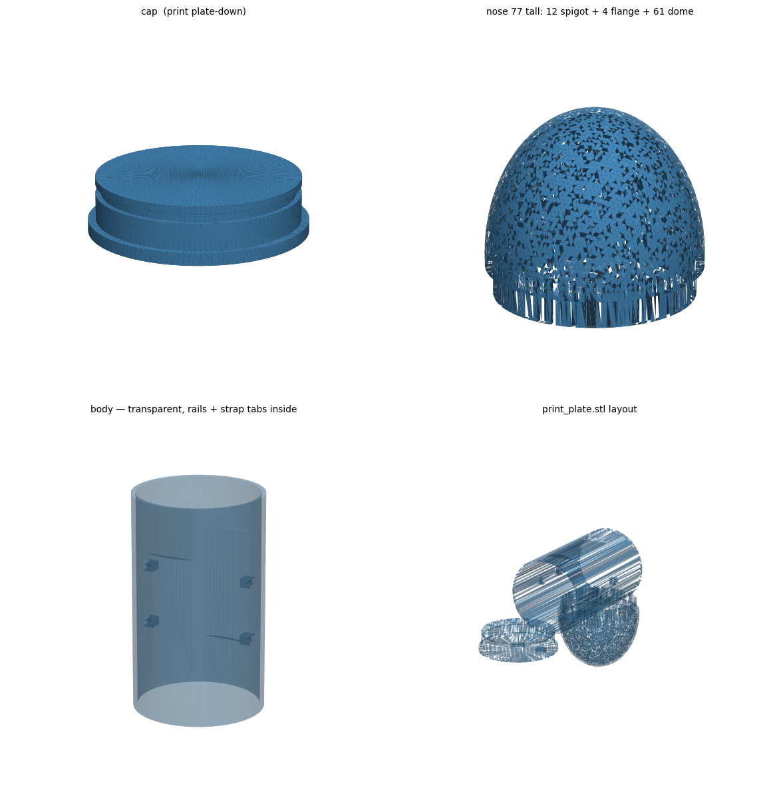

# SSC-EduTech: lab notes on AI systems for school technology work

Improving technology for education.

## Abstract

SSC-EduTech is an education-technology exploration of several AI systems, with each system tried on a different kind of school work. These notes record what each one was used for and what was actually written down. Amazon Quick (AWS) automates an Education Bureau (EDB) teacher-training path from the public calendar to a weekly email and then to the teacher's calendar, including a conflict message and an override reply. OpenManusBot is under test for multi-agent task automation and councils, with Composio connectors, a 20-minute turn limit, and a short rule against repeated tool calls. GrokBot is the desktop coordinator for orchestration, repository and site work, documentation, and handoffs to other agents; a scored results log for that role is still open. A local Ollama and Qwen deployment was examined for on-prem privacy on one dual-GPU workstation. Z.ai assisted a printable mechanical design, a buoyancy profiling float, reproduced here as a four-panel print-plate figure.

## 1. Amazon Quick (AWS) Research

This section records an email-and-calendar study for an ICT teacher who follows the EDB training calendar in Hong Kong.

### Methods

The tracker checks the EDB training calendar every week. It searches a keyword (for example ICT) and collects notices added in the last 7 days, then emails the teacher a weekly summary of classes and training that concern them.

The teacher replies on that thread, including a reply to the trigger address `replytocal@aws.com`. That reply starts the second flow:

1. Read the latest weekly ICT course summary in the inbox.
2. See which sessions the teacher wants on their calendar.
3. If a session does not conflict with the current calendar, add it and send a confirmation.
4. If it does conflict, send a second email that says so. The teacher can reply to that email to override the conflict and add the session anyway.

The two prompts below are the ones submitted to Amazon Quick. Spelling is left as submitted.

```
Prompt 1 (Main Flow):
Make an automated email flow that when triggered checks the user email inbox for the latest Weekly ICT Course Summary from EDB Training Calendar subject email. Check the replies and the email content to see which events the teacher would like to add to their calender, if there are no conflicts with the teachers calender then add to the calender and send a new email saying added. If there are conflicts the email is still sent to the user and it tells them there are conflicts, and the user is able to reply to this email to override it and still add it to calender even if its conflicted
```

```
Prompt 2 (Secondary calendar flow):
I am an ICT teacher of a secondary school, in charge of teaching senior form ICT and the IT Department in Hong Kong. I want a weekly summary sent to my email  ryanyeung0925@gmail.com, please go to https://tcs.edb.gov.hk/tcs/publicCalendar/start.htm and retrieve relavant courses in the past 7 days
```

### Observations

As specified, the study has two stages. The weekly stage reads [the public EDB training calendar](https://tcs.edb.gov.hk/tcs/publicCalendar/start.htm) and sends a summary of relevant courses from the past 7 days. The reply stage, started through `replytocal@aws.com`, reads which sessions the teacher wants, writes non-conflicting sessions to the calendar, and on a conflict sends a further email that the teacher can answer in order to add the session anyway. Delivery counts, time saved, and error rates are left for a later entry.

### Discussion

The procedure keeps the teacher inside email: a weekly summary, a reply, and a calendar write, with an explicit path when a proposed session overlaps an existing one. The second prompt limits the case to senior-form ICT and IT-department training notices.

## 2. OpenManusBot

OpenManusBot is an alternative to GrokBot ([Section 3](#3-grokbot)). In these notes it is the system under test for automated tasks and AI councils.

### Methods

Testing so far includes Kimi K3 and OpenCode, which provides a free model. OpenAI-compatible models were also tried. External apps (Gmail, Calendar, Slack, Notion, and others) are reached only through Composio tool calls. The prompt given to the agent is reproduced below in full.

Local 8B and 14B models cannot drive connector MCPs, so they stay off the chief-of-staff role. The working arrangement is a stronger chief of staff — Kimi K3, Grok, or an OpenCode free model — with a local model such as Qwen 120B as the secrets model for material that should stay private. Hardware limits for that local model are in [Section 4](#4-local-llm).

```
Prompt for Local Agent to Access Tools
## CONNECTED APPS — Composio tools (Gmail, Calendar, Slack, Notion, any app)

External apps are reached ONLY through these tool calls — exact names, always
with the composio_ prefix, never written as text in a reply:

- composio_COMPOSIO_SEARCH_TOOLS — find tools for an app
- composio_COMPOSIO_GET_TOOL_SCHEMAS — get a tool's parameters
- composio_COMPOSIO_MULTI_EXECUTE_TOOL — run a tool
- composio_COMPOSIO_MANAGE_CONNECTIONS — connect or fix an app

### WORKFLOW — one tool call per turn, then wait for the result

1. SEARCH_TOOLS for the app the user named (e.g. "calendar").
2. GET_TOOL_SCHEMAS for the exact slug(s) you need — several can be fetched
   in one call; pass session_id if SEARCH returned one. Skip this step if the
   schema is already in this conversation.
3. MULTI_EXECUTE_TOOL with that slug and arguments matching the schema
   exactly — right names, right types, no extra fields.
4. Read the full result, then reply to the user in plain text.

Never execute a tool you haven't seen the schema for. Use exact slugs from
SEARCH — never app names like "gmail". If the request needs no app (simple
greetings or questions), just reply — no tool calls.

### ERRORS — always recover, never improvise

- "Invalid" call → the error lists valid names and parameters. Fix and retry
  immediately. Never fall back to bash, glob, or webfetch.
- App not connected → MANAGE_CONNECTIONS, then tell the user what to do.
- Empty result → widen the query once, then report honestly.
- Truncated/saved result → agents_tool_result_read with the saved id.

### WRITE ACTIONS

Reads (search, list, get) need no confirmation. Writes (send, create, update,
delete, post) only when the user clearly asked for exactly that — if
ambiguous, ask first. Say in one short line what you're about to write, then
do it. Never chain unrequested extra actions — offer them instead.

### CONNECTIONS

Never connect an app on your own initiative — only when the user asks or a
needed app turns out to be unconnected.

### DATES — compute them yourself

Today is {TODAY_DATE}. Never write placeholders like {{date_sub(2)}} — use
real dates; many apps take ranges, e.g. after:YYYY/MM/DD before:YYYY/MM/DD.

### HONESTY

Never tell the user an action succeeded unless you saw its successful result
in this conversation.

### WORKED EXAMPLE (calendar)

User: "What do I have tomorrow? Put a 15-min break at noon."
1. SEARCH_TOOLS query:"calendar" → slugs (and session_id if returned)
2. GET_TOOL_SCHEMAS for the find-events and create-event slugs
3. MULTI_EXECUTE_TOOL find-events, after/before = tomorrow's real dates
   → "You have 3 events: …" + "I'll add a 15-minute 'Break' at 12:00
   tomorrow."
4. MULTI_EXECUTE_TOOL create-event → confirm with what the result says.

```

The room turn timeout was raised from 5 minutes to 20 minutes so the agent can continue on larger tasks. The safe edit procedure (quit, back up, merge the JSON, relaunch) is in [`turnTimeoutMinutes_skills.md`](turnTimeoutMinutes_skills.md).

```
  "rooms": {
    "turnTimeoutMinutes": 20
  }
```

Repeated MCP calls are common on complex tasks. When warnings such as `Same call repeated 5× — tool: MCP: tool — it may be stuck` appear, the block below is added to the end of the agent `soul.md`.

```
Agent to prevent MCP overload

Never move file contents through the conversation — not as base64, not as
text, not "in batches", not as tool-call-sized pieces, and not by uploading
file contents through an API or workbench tool call. To publish, deploy,
upload, or send files, use one shell command (git push, rsync, scp, a deploy
script, or the hosting CLI) so files go from disk to destination without
passing through you. If that shell path fails — for example git push needs
auth — stop and tell the user exactly which credential or command to fix;
never work around it by moving file contents through tool calls.

If the same tool call or command fails or needs approval twice in a row,
do not issue the identical call again. Change approach or ask the user.
```

### Observations


*Figure. OpenManusBot session from the council and task-automation trials.*

Fully automated tasks in this setup ran with Kimi K3 or an OpenCode free model as chief of staff. OpenAI-compatible models were tried; on their own they left the automated task unfinished. Local 8B and 14B models did not operate the connector MCPs, which is why the secrets-model role is assigned to a larger local model (see [Section 4](#4-local-llm)). The `soul.md` block is aimed at two failure modes: moving file contents through the conversation, and issuing the same failing call again. A counted before/after of the repeated-call warning can be added when it is collected.

### Discussion

OpenManusBot is the strand for tool-using councils. GrokBot remains the desktop coordinator ([Section 3](#3-grokbot)). The split between a stronger chief of staff and a local secrets model is the same privacy split examined in [Section 4](#4-local-llm).

## 3. GrokBot

GrokBot is the desktop, coordinator-style assistant in this education-technology stack. Earlier notes in this repository introduce OpenManusBot as an alternative under test. This section records the role GrokBot holds in the project and leaves a place for later results.

### Methods

Work assigned to GrokBot is coordination rather than a single closed workflow. In practice that has meant:

- Orchestrating a multi-step school-technology task and deciding which part stays with GrokBot.
- Repository and site work: reading the project, editing notes and site material, and keeping the written record aligned with what was tried.
- Multi-agent teaming: handing a bounded piece of work to another agent, including a cloud coding session or the OpenManusBot council in [Section 2](#2-openmanusbot), then taking the result back into the project.
- Documentation of the other strands (the EDB email flow, the local-model log, and the Z.ai design study).

No separate tool prompt, timeout file, or connector list is stored for GrokBot in this repository. Those details, where they exist, belong to the OpenManusBot trial.

### Observations

The strength observed so far is the coordinator role itself: GrokBot is where orchestration, repository and site edits, documentation, and handoffs meet. It is used beside OpenManusBot, which carries the Composio tool loop and the council trials. Side-by-side scores against OpenManusBot, Kimi K3, or the local models are left for a later entry.

### Results

A results log is reserved here for later entries. A useful entry records the task, whether GrokBot did the work directly or handed it on, which agent received the handoff, and whether the handoff finished. Completion counts and timings are omitted until those entries exist.

### Discussion

GrokBot fits the work that spans several systems in these notes: keeping the written record, editing the repository, and passing a well-bounded task to OpenManusBot or a cloud coding session. Until the results log has entries, this section stays a methods note.

## 4. Local LLM

This section records an on-prem privacy trial: Ollama and Qwen on a school workstation, so sensitive work and student-related material can stay on hardware the school controls.

### Methods

Planned tiers on the machine below:

- **8–9B local** for sensitive work.
- **Qwen3-30B-A3B** (mixture-of-experts) on a local school server.
- **Cloud models** for everything else.

The same split appears in the OpenManusBot trial: 8B and 14B models could not drive connector MCPs, so a stronger chief-of-staff model handles tools and the local model handles private material.

**Hardware:** workstation, 2× RTX 3080 10 GB (20 GB total VRAM, no NVLink → PCIe split), 32 GB system RAM.

The interventions below were the procedure under test, cheapest first. Speeds are observations or targets for this machine only.

**1. Diagnose before changing anything**

```bash
ollama ps          # PROCESSOR column: "100% GPU" is good; "x%/y% CPU/GPU" = spill
nvidia-smi         # both 3080s visible? how much VRAM used?
```

**2. Switch to the MoE model** — this alone is usually a 4–6× jump

```bash
ollama pull qwen3:30b-a3b
ollama run qwen3:30b-a3b
```

**3. Force full GPU offload / both GPUs**

```bash
CUDA_VISIBLE_DEVICES=0,1 ollama serve
```

and in the Modelfile / runtime:

```
PARAMETER num_gpu 99
```

Note: `num_gpu` counts *layers*. On an MoE the expert tensors are the bulk of the mass, so "99 layers on GPU" does not guarantee the experts are. Trust `ollama ps` over the Modelfile.

**4. Shrink and quantize the KV cache** (the other half of "does it fit")

```bash
OLLAMA_FLASH_ATTENTION=1 OLLAMA_KV_CACHE_TYPE=q8_0 OLLAMA_SCHED_SPREAD=1 ollama serve
```

- `KV_CACHE_TYPE=q8_0` halves KV VRAM — the biggest "fits vs doesn't" lever at longer context.
- `SCHED_SPREAD=1` — **undocumented / experimental**, not in Ollama's official docs. If used, verify the effect with `ollama ps`; Ollama's FAQ states it already auto-spreads a model across GPUs when it will not fit on one, so this is a last-resort lever, not a required setting.
- `FLASH_ATTENTION=1` pairs with q8_0 KV (needs both).

**5. Reduce context**

```bash
>>> /set parameter num_ctx 8192   # 32k context is a large VRAM delta
```

**6. Disable Qwen3 "thinking" when not needed.** `qwen3:30b-a3b` emits reasoning tokens before answering, so it *feels* 2–5× slower even at full GPU. Use `/no_think` in the prompt.

**7. Verify with a number, not a vibe**

```bash
ollama run qwen3:30b-a3b --verbose   # prints eval rate = tok/s
```

### Results

Generation on the initial load ran at ~10 tokens/sec, too slow to be usable.

10 tok/s is a **diagnostic, not a tuning problem**: it means a significant part of the model is running on **CPU**, not GPU. Two likely causes:

1. **Wrong model loaded.** The dense 32B model at 4-bit is ~19–20 GB *before* KV cache. On a 20 GB box it cannot fully fit, so layers spill to the 32 GB system RAM and decode collapses to single digits.
2. **Ollama not spreading across both GPUs.** Ollama's official FAQ states it already auto-spreads a model across GPUs when it will not fit on one, so "default piles everything on GPU 0" is *not* documented behavior. Treat this as a possible cause to verify with `ollama ps` / `nvidia-smi`, not an assumption.

There is **no "27B Qwen"** — the relevant models are **Qwen3-30B-A3B** (MoE, ~3B active parameters) and **Qwen2.5/3-32B** (dense). The MoE/dense choice is the whole answer.

For the MoE weights themselves: 4-bit weights ~17–18 GB, only ~3B active at a time → 40–60 tok/s single-stream on this box. That figure is the expected single-stream rate once the model is fully on GPU. The check used in this log is `ollama ps` reading `100% GPU`, with `ollama run qwen3:30b-a3b --verbose` printing the eval rate. Target: eval rate lands ~40–60 tok/s.

#### Engine choice — Ollama vs llama.cpp vs vLLM

The engine was never the bottleneck; **VRAM was**.

| Engine | Best for | Notes on this hardware |
| --- | --- | --- |
| **Ollama** (llama.cpp) | single / low-concurrency pilot | Right choice here; lowest ops overhead |
| **llama.cpp server** | same, plus tuning knobs | `-ngl 99 -fa -ctk q8_0 -ctv q8_0 -c 8192 --split-mode layer` |
| **vLLM** | high concurrency on a real serving box | Needs AWQ/GPTQ (not GGUF); paged-KV/CUDA-graph overhead; won't fit 30B MoE on 20 GB |

- On a 20 GB box, vLLM's own overhead is *worse* than Ollama's. The wall is VRAM, not software: 20 GB cannot hold 17–18 GB of MoE weights *plus* batching headroom.
- vLLM would **not** fix 10 tok/s — that is CPU offload, and vLLM would likely OOM or refuse.
- The GGUF MoE path is **not supported / not recommended** in vLLM (GGUF support is limited/experimental and MoE+GGUF is effectively unsupported); use an **AWQ/GPTQ** (or FP8) artifact for vLLM instead.

#### Version notes (verified)

- **vLLM ≥ v0.8.5** is the first release with Qwen3 / Qwen3-MoE support (release notes: "Day 0 support for Qwen3 and Qwen3MoE").
- **`OLLAMA_FLASH_ATTENTION`** and **`OLLAMA_KV_CACHE_TYPE`** (`f16`/`q8_0`/`q4_0`) are documented in Ollama's official FAQ; quantized KV **requires** Flash Attention.
- **`OLLAMA_SCHED_SPREAD`** is **undocumented/experimental** — not in official docs (see Fix 4).
- Confirm your own builds before quoting numbers: `ollama -v`, and check the vLLM release notes for MoE support.

### Discussion

This workstation is a **pilot tier only**. Realistic concurrency: 1–2 users fine, 3–5 usable with rising latency, class-size or admin-desk concurrency collapses. 100+ staff needs a **dedicated serving box (48–96 GB+ VRAM) running vLLM**.

**Move to vLLM when:** sustained **≥8 concurrent users** past the P95 latency target, **or** long-context/RAG at **≥4 concurrent** — *and* you have **≥48 GB VRAM**. Until then, stay on Ollama.

Three-pillar check:

- **Privacy:** local 8–9B for sensitive and student work is the strongest play; keep student data off mainland processing nodes and keep the school's PDPO duties (parent-consent notices on cross-border transfer) in view.
- **Sustainability:** the 30B tier on a single workstation is the weakest link — no SLA, no redundancy, PCIe-split. Fine as a pilot, not as school infrastructure.
- **Functions:** MoE gets you a usable single-user tier; it does not make this box a shared school service.

## 5. Z.ai (CAD / mechanical design case study)

Z.ai is the system used here for printable mechanical design. The case is a buoyancy profiling float for school technology work, including competition robotics: parts a workshop can slice, print, and assemble.

### Methods

Z.ai generated and assisted the solid model. The float is split into three pieces that share one print plate: a cap, a nose, and a body. The cap is oriented print-plate-down. The nose is labeled on the model as 77 tall, made up of a 12 spigot, a 4 flange, and a 61 dome, in the units of the source file. The body is shown transparent so the internal rails and strap tabs stay visible before printing. The plate layout is the file `print_plate.stl`.

### Results

The design output is the four-panel figure below: a Z.ai render of the model and the print-plate layout.



*Figure. Z.ai CAD study of a buoyancy profiling float, laid out for one print plate. Top left: cap (print plate-down). Top right: nose, labeled 77 tall (12 spigot + 4 flange + 61 dome). Bottom left: transparent body with internal rails and strap tabs. Bottom right: the three parts in the `print_plate.stl` layout.*

### Discussion

The figure is enough to check print orientation, the nose stack-up, and whether the internal rails and strap tabs are present in the body. A later entry can record the sliced plate, the printer and material, and whether the three parts seated together. Print and fit-up results are reserved for that entry.
